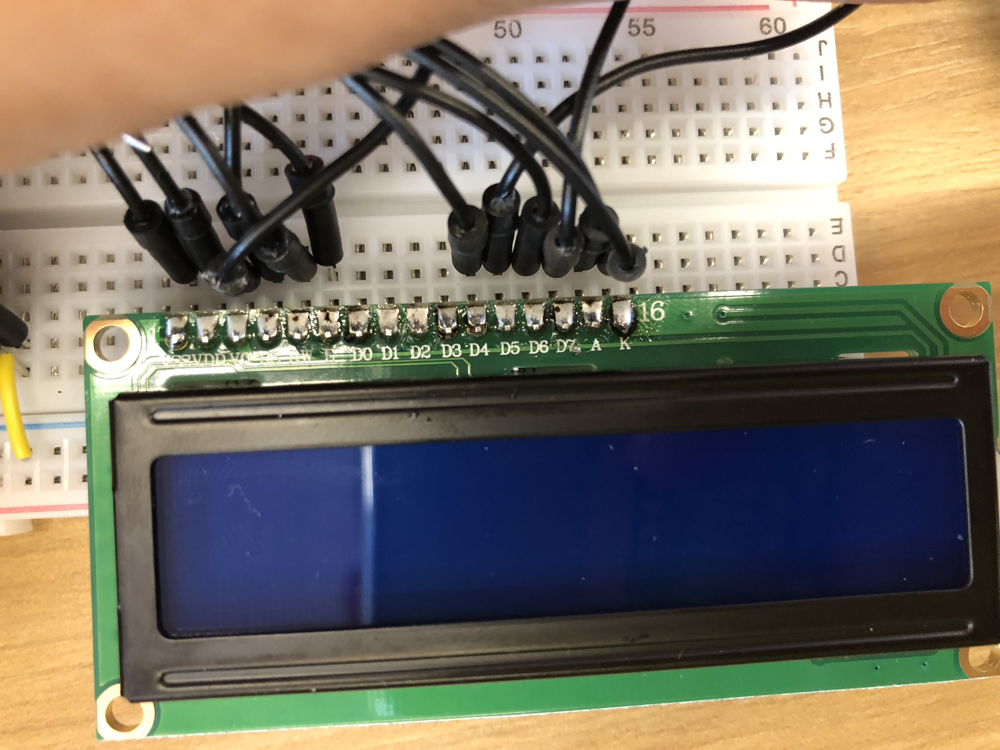

# Make a Digital Timer!

##### Rongxin Zhang (rz345)

## Overview
For this assignment, you are going to

A) [Solder your LCD panel](#part-a-solder-your-lcd-panel)

B) [Write text to an LCD Panel](#part-b-writing-to-the-lcd)

c) [Using a time-based digital sensor!](#part-c-using-a-time-based-digital-sensor)

D) [Make your Arduino sing!](#part-d-make-your-arduino-sing)

E) [Make your own timer](#part-e-make-your-own-timer)


## Part A. Solder your LCD panel



## Part B. Writing to the LCD

**a. What voltage level do you need to power your display?**

It uses 5V from the power supply.

**b. What voltage level do you need to power the display backlight?**

We tested it with 3.3V

**c. What was one mistake you made when wiring up the display? How did you fix it?**

The issue was the separations of the different sections in the large bread-board. Power did not cross between the boards. As a result, my LCD screen was not getting any power. Simply connected the breaks in the breadboard.

**d. What line of code do you need to change to make it flash your name instead of "Hello World"?**

Changed this line of code,

```java
lcd.print("Rongxin Zhang");
```

**e. Include a copy of your Lowly Multimeter code in your lab write-up.**

```java
int sensorPin = A0;    // select the input pin for the potentiometer
int sensorValue = 0;

void setup() {
  // set up the LCD's number of columns and rows:
  lcd.begin(16, 2);
  // Print a message to the LCD.
}

void loop() {
  // Turn off the display:
  sensorValue = analogRead(sensorPin);

  lcd.setCursor(0,0);
  // Turn on the display:

  lcd.print(sensorValue);
  delay(1000);
}
```

[Full Code](./potentiometer.ino)

## Part C. Using a time-based digital sensor

**Upload a video of your working rotary encoder here.**

[Singing Video](./assets/part_d.MOV)

## Part D. Make your Arduino sing!

You can change the `noteDurations[]`, such that they are shorter

**b. What song is playing?**

Star Wars song.

[Full Code](./playTune.ino)

## Part E. Make your own timer

**a. Make a short video showing how your timer works, and what happens when time is up!**

**b. Post a link to the completed lab report your class hub GitHub repo.**1