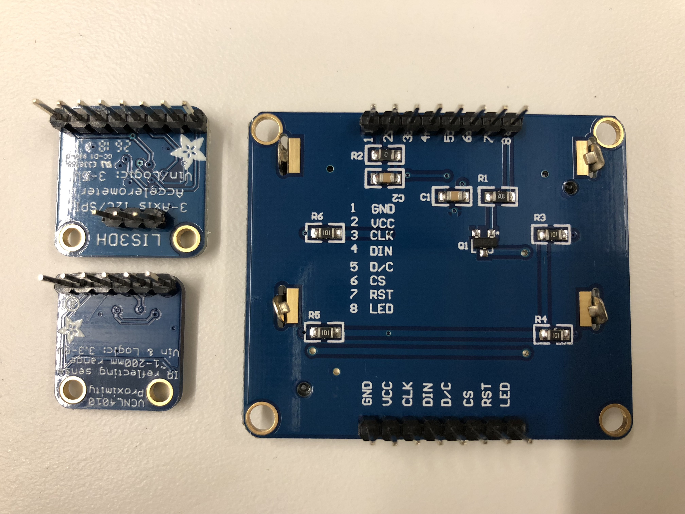
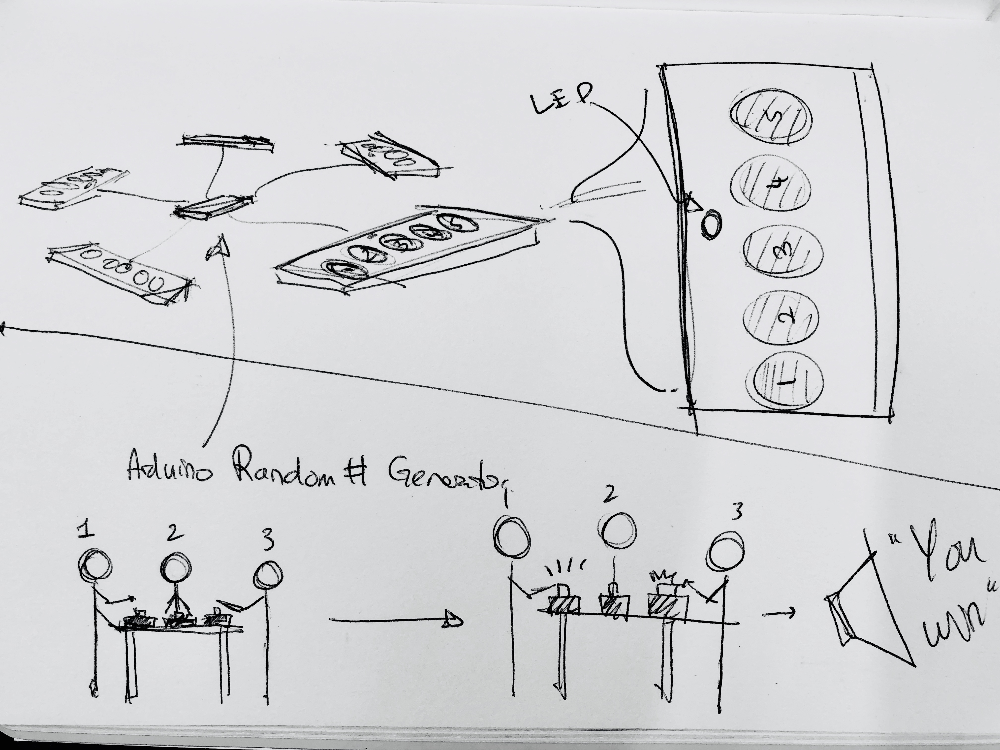
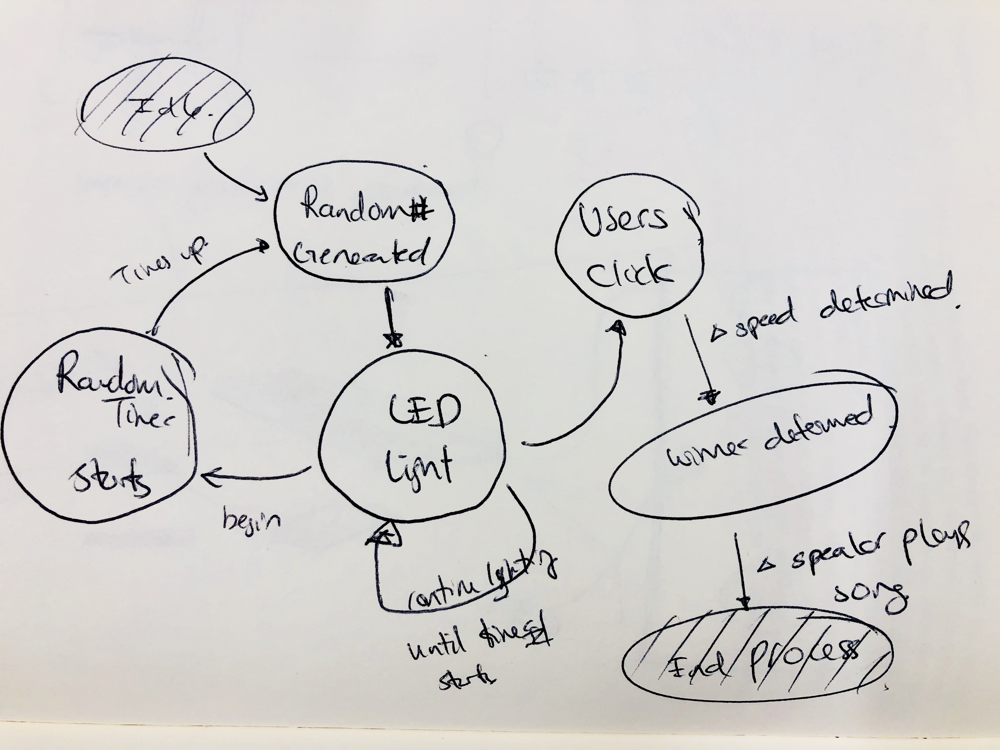

## Lab Prep 3: Data Logger

### Soldering pins to board

*Front of board*

*Back of board*

### Project Idea + State Diagram

##### Reaction timing competitive game

1. There are 6 players
2. Each player have 6 buttons in front of them.
3. A secure random number generator generates 3 values: a) time between 1 - 10 seconds b) player between 1-6 c) player between 1-6.
4. There will be a light in front of each of the players.
5. The 2 player that is random selected must click the other person’s button as quick as possible.
6. Who ever clicks first wins.
7. When they win a “Tekken winner” sound is made.
8. The next round happens at random times.

*Game and player flow*

*State Diagram*
