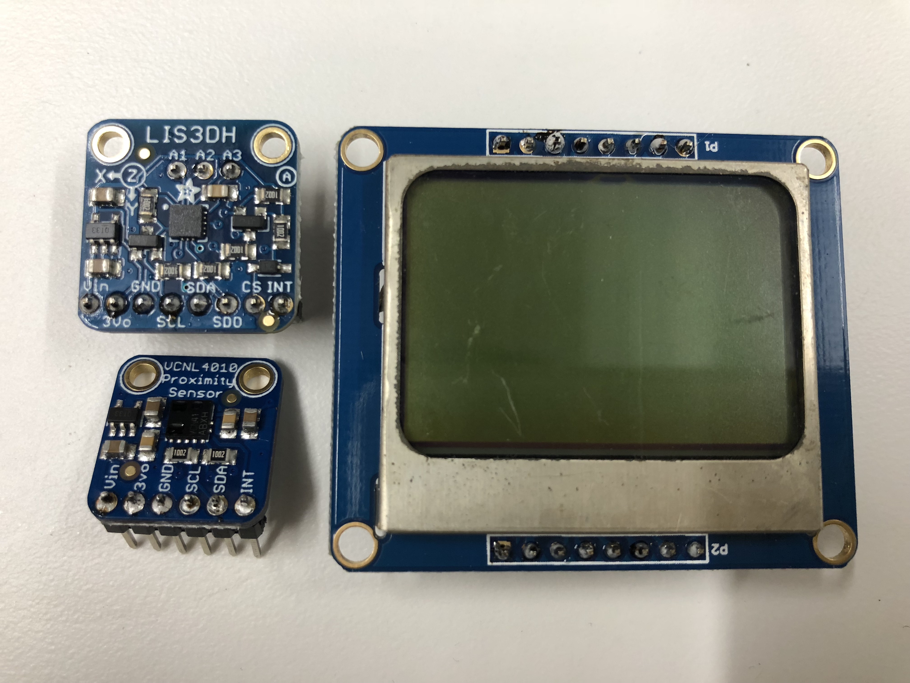

## Lab Prep 3: Data Logger

### Soldering pins to board

*Front of board*

*Back of board*

### Project Idea + State Diagram

##### Reaction timing competitive game

1. There are 6 players
2. Each player have 6 buttons in front of them.
3. A secure random number generator generates 3 values: a) time between 1 - 10 seconds b) player between 1-6 c) player between 1-6.
4. **Data Logging:** Random number is generated from a variety of external sensors that act as high entropy inputs. These numbers are then stored within the arduino, and convert into a single number which will be used by the machine to select which players will battle each other.
5. There will be a light in front of each of the players.
6. The 2 player that is random selected must click the other person’s button as quick as possible.
7. Who ever clicks first wins.
8. When they win a “Tekken winner” sound is made.
9. The next round happens at random times.

*Game and player flow*

*State Diagram*
