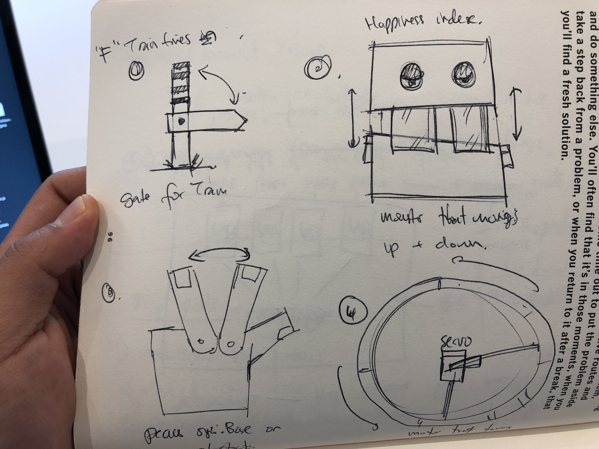
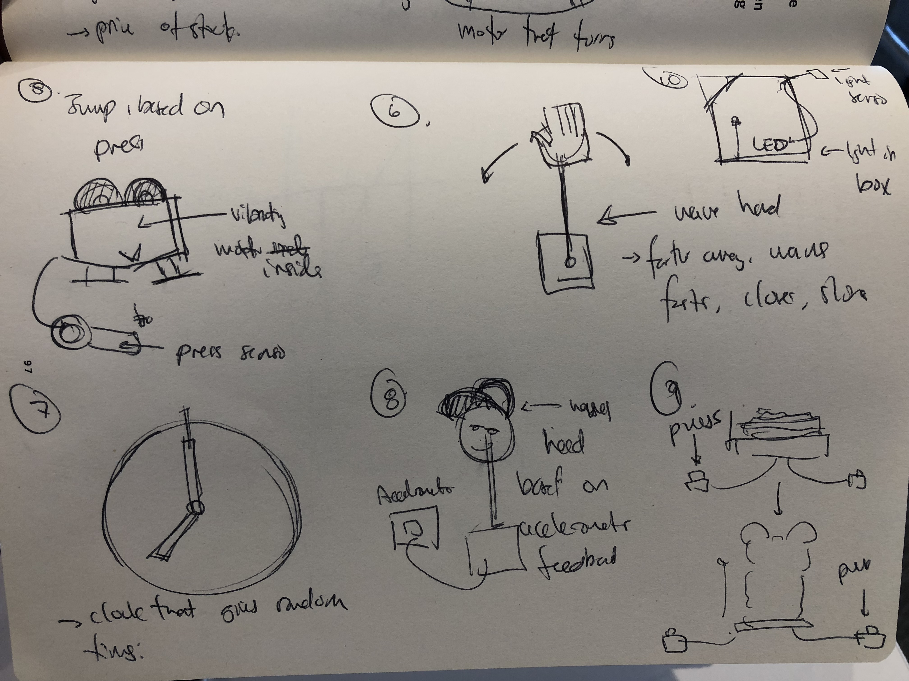

## Lab Prep 4: Paper Ideas

*ideas 1-4*

*ideas 5-10*

### Idea Details

1. A train sign that goes up and down based on the arrival time of the F-train
2. A monster that moves it's mouth up and down based on some input from
3. A peace sign that movs the fingers closer or farther together based on price of stocks
4. A wheel that just rotates itself based on proximity sensors.
5. A bouncing frog that vibrates more or less based on the the pressure from the the press sensor.
6. A hand that waves based on proximity sensor. The closer you are the slower it waves, the further you are the faster it waves.
7. A close that changes time to a random input once every minute.
8. A head that swings back and fourth following the movements of the acceleromenter.
9. A paper deflating mickeymouse that goes up and down based on button presses
10. A light box that lights up in different colors based on the combination of inputs e.g proximity sensor, preasure sensor.
