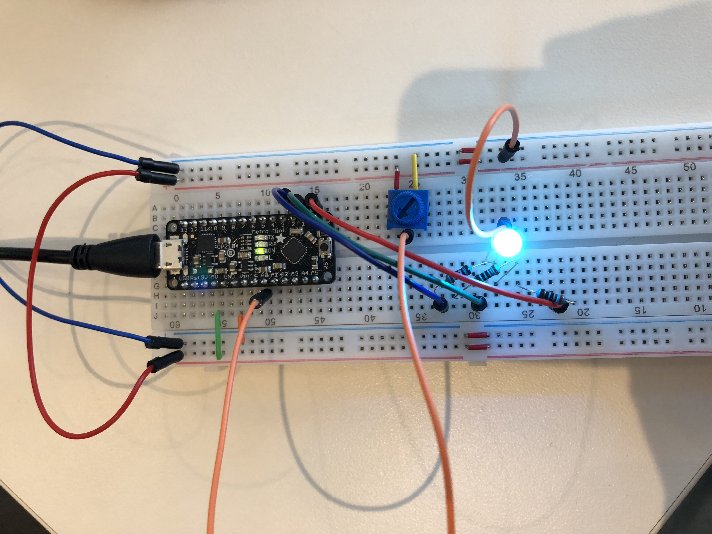
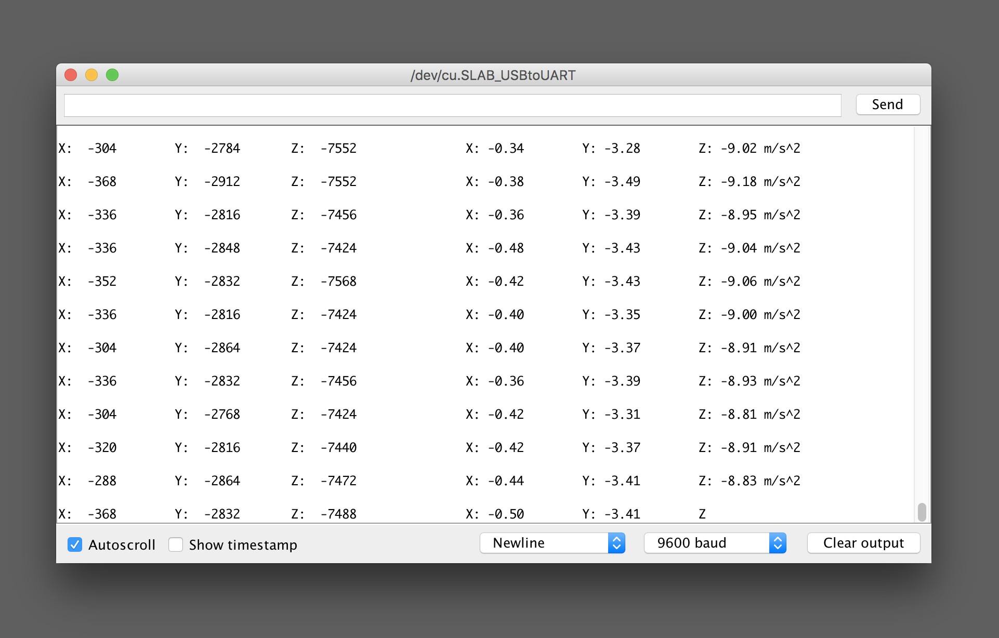
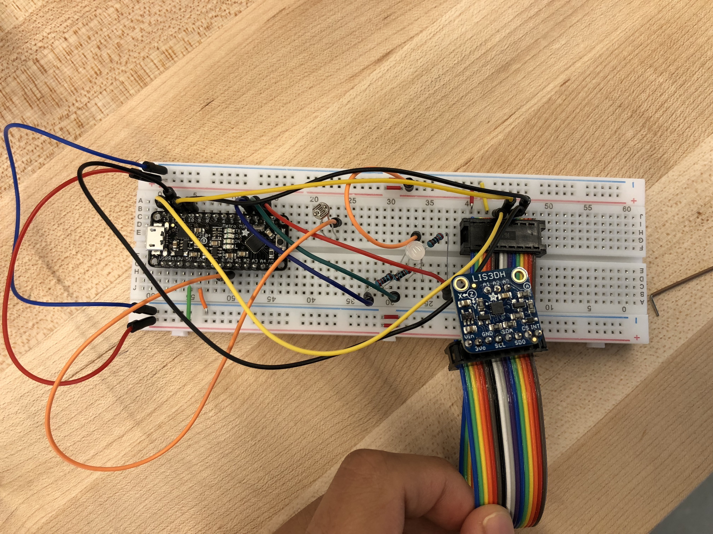

# Data Logger (and using cool sensors!)

*A lab report by Rongxin Zhang (rz345).*

## In The Report

Include your responses to the bold questions on your own fork of [this lab report template](https://github.com/FAR-Lab/IDD-Fa18-Lab2). Include snippets of code that explain what you did. Deliverables are due next Tuesday. Post your lab reports as README.md pages on your GitHub, and post a link to that on your main class hub page.

For this lab, we will be experimenting with a variety of sensors, sending the data to the Arduino serial monitor, writing data to the EEPROM of the Arduino, and then playing the data back.

## Part A.  Writing to the Serial Monitor

**a. Based on the readings from the serial monitor, what is the range of the analog values being read?**
The range is between `0 - 1023`

**b. How many bits of resolution does the analog to digital converter (ADC) on the Arduino have?**
It has 10 bits of resolution as the maximum value is `2^10 = 1024`

## Part B. RGB LED

**How might you use this with only the parts in your kit? Show us your solution.**

## Part C. Voltage Varying Sensors




### 1. FSR, Flex Sensor, Photo cell, Softpot

**a. What voltage values do you see from your force sensor?**
I see `1004`

**b. What kind of relationship does the voltage have as a function of the force applied? (e.g., linear?)**

The more pressure, the smaller the volatage. It does not seem to be linear. The press is very sensitive. It's seems to much easier to get either a very large number or small number.

**c. Can you change the LED fading code values so that you get the full range of output voltages from the LED when using your FSR?**

Yes I can.

**d. What resistance do you need to have in series to get a reasonable range of voltages from each sensor?**

**e. What kind of relationship does the resistance have as a function of stimulus? (e.g., linear?)**

The relationship is linear because the greater the voltage the greater the resistance assuming current is the same. `resistance = voltage / current`

### 2. Accelerometer

**a. Include your accelerometer read-out code in your write-up.**


Accelerometer outputs


Accelerometer attached

[](https://youtu.be/5a6-GCd6Awg)
Accelerometer Video

### 3. IR Proximity Sensor

**a. Describe the voltage change over the sensing range of the sensor. A sketch of voltage vs. distance would work also. Does it match up with what you expect from the datasheet?**

[](https://youtu.be/rEHnUGYaqts)
Proximity Sensor Video

**b. Upload your merged code to your lab report repository and link to it here.**

```java
// Basic demo for accelerometer readings from Adafruit LIS3DH

#include <Wire.h>
#include <SPI.h>
#include <Adafruit_LIS3DH.h>
#include <Adafruit_Sensor.h>

// Used for software SPI
#define LIS3DH_CLK 13
#define LIS3DH_MISO 12
#define LIS3DH_MOSI 11
// Used for hardware & software SPI
#define LIS3DH_CS 10

// software SPI
Adafruit_LIS3DH lis = Adafruit_LIS3DH(LIS3DH_CS, LIS3DH_MOSI, LIS3DH_MISO, LIS3DH_CLK);

#if defined(ARDUINO_ARCH_SAMD)
// for Zero, output on USB Serial console, remove line below if using programming port to program the Zero!
   #define Serial SerialUSB
#endif

void setup(void) {
#ifndef ESP8266
  while (!Serial);     // will pause Zero, Leonardo, etc until serial console opens
#endif

  Serial.begin(9600);
  Serial.println("LIS3DH test!");

  if (! lis.begin(0x19)) {   // change this to 0x19 for alternative i2c address
    Serial.println("Couldnt start");
    while (1);
  }
  Serial.println("LIS3DH found!");

  lis.setRange(LIS3DH_RANGE_4_G);   // 2, 4, 8 or 16 G!

  //  
  //  Proximity Sensor
  //  
  Serial.begin(9600);
  Serial.println("VCNL4010 test");

  if (! vcnl.begin()){
    Serial.println("Sensor not found :(");
    while (1);
  }
  Serial.println("Found VCNL4010");

  Serial.print("Range = "); Serial.print(2 << lis.getRange());  
  Serial.println("G");
}

void loop() {
  lis.read();      // get X Y and Z data at once
  // Then print out the raw data
  Serial.print("X:  "); Serial.print(lis.x);
  Serial.print("  \tY:  "); Serial.print(lis.y);
  Serial.print("  \tZ:  "); Serial.print(lis.z);

  /* Or....get a new sensor event, normalized */
  sensors_event_t event;
  lis.getEvent(&event);

  /* Display the results (acceleration is measured in m/s^2) */
  Serial.print("\t\tX: "); Serial.print(event.acceleration.x);
  Serial.print(" \tY: "); Serial.print(event.acceleration.y);
  Serial.print(" \tZ: "); Serial.print(event.acceleration.z);
  Serial.println(" m/s^2 ");

  //  
  //  Proximity Sensor
  //  
  Serial.print("Ambient: "); Serial.println(vcnl.readAmbient());
  Serial.print("Proximity: "); Serial.println(vcnl.readProximity());

  Serial.println();

  delay(200);
}
```

[Merged code](./combined-code/combined-code.ino)

## Optional. Graphic Display

**Take a picture of your screen working insert it here!**

## Part D. Logging values to the EEPROM and reading them back

### 1. Reading and writing values to the Arduino EEPROM

**a. Does it matter what actions are assigned to which state? Why?**

**b. Why is the code here all in the setup() functions and not in the loop() functions?**

**c. How many byte-sized data samples can you store on the Atmega328?**

**d. How would you get analog data from the Arduino analog pins to be byte-sized? How about analog data from the I2C devices?**

**e. Alternately, how would we store the data if it were bigger than a byte? (hint: take a look at the [EEPROMPut](https://www.arduino.cc/en/Reference/EEPROMPut) example)**

**Upload your modified code that takes in analog values from your sensors and prints them back out to the Arduino Serial Monitor.**

### 2. Design your logger

**a. Insert here a copy of your final state diagram.**

### 3. Create your data logger!

**a. Record and upload a short demo video of your logger in action.**
