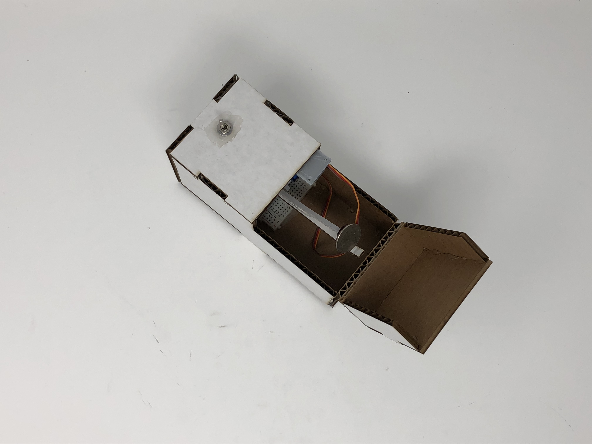
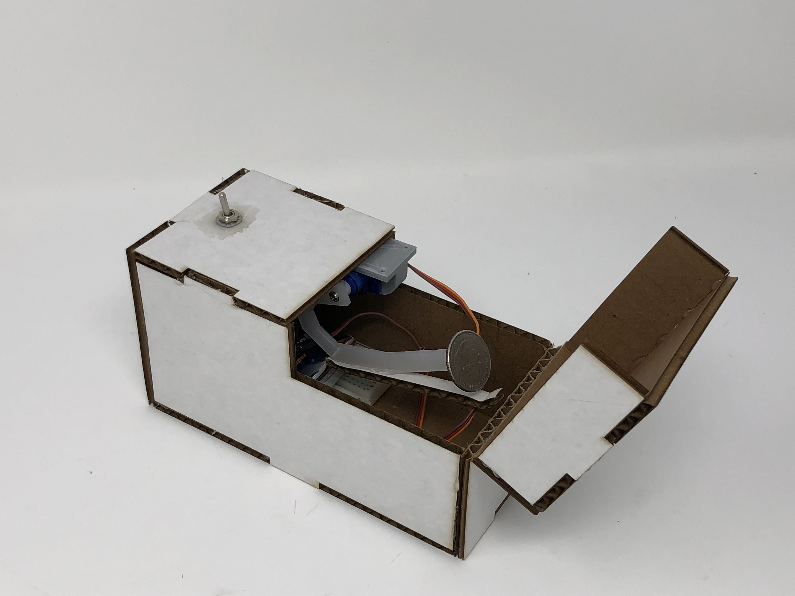
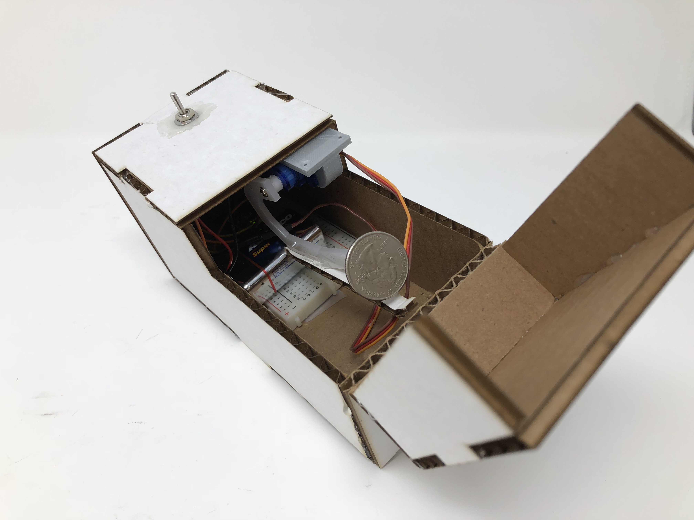

# Useless Box

*A lab report by Rongxin Zhang rz345*

## In this Report

## Your Arduino code.

```java
#include <Servo.h> 

#define servoPin  9
#define switchPin 2

#define closePos  00
#define openPos   180

Servo servo;
int switchState;
int previousSwitchState;

void ToggleSwitch(int switchState)
{    
  if (switchState == HIGH) {
    servo.write(openPos);
  } else {
    servo.write(closePos);
  }
  previousSwitchState = switchState;  // remember that the switch state has changed 
}

void setup()
{
 
  switchState = LOW;
  previousSwitchState = LOW;

  servo.attach(servoPin);
  servo.write(closePos);

  // we should probably pay attention to the switch
  pinMode(switchPin, INPUT); 
}

void loop()
{ 
  int switchState = digitalRead(switchPin);
  if (switchState != previousSwitchState)
    ToggleSwitch(switchState);

  delay(20);
}
```
[Original Code](./useless/useless.ino)

### .stl or .svg files for your "bopper" — if you use some other technique, include the respective supporting material.


SVG file of bopper

## At least one photo of your useless box taken in the MakerLab's Portable Photo Studio (or somewhere else, but of similar quality).


*top*

*three quatre view*

*inside*


## A video of your useless box in action.

[](https://youtu.be/FIcWZeOlZiw)
