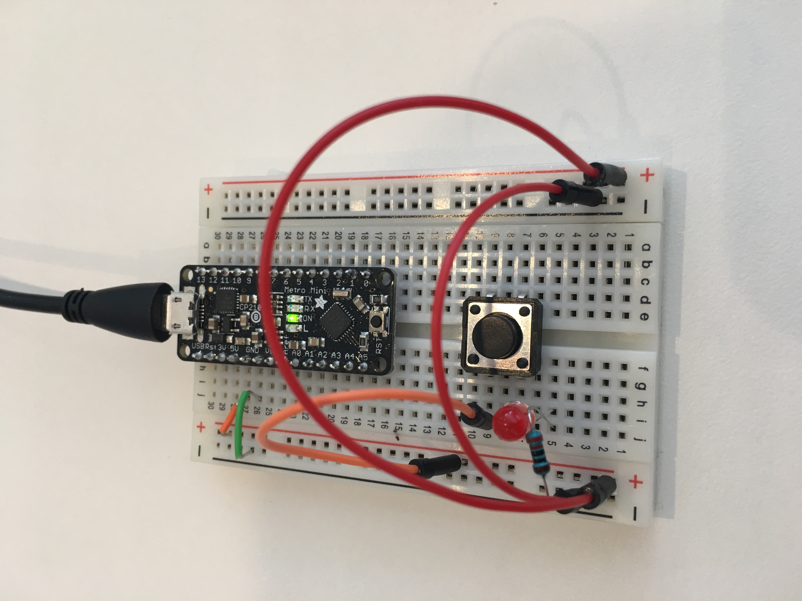
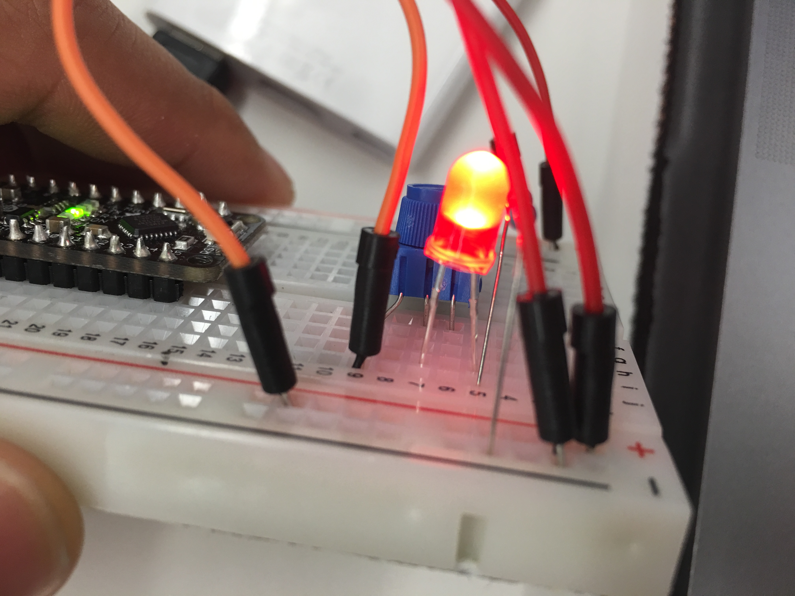
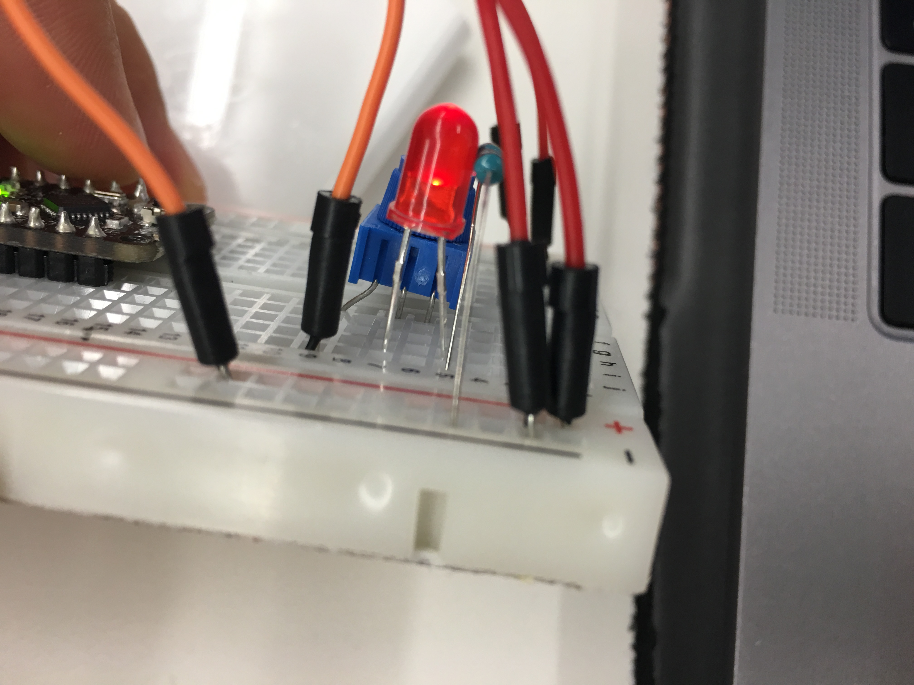
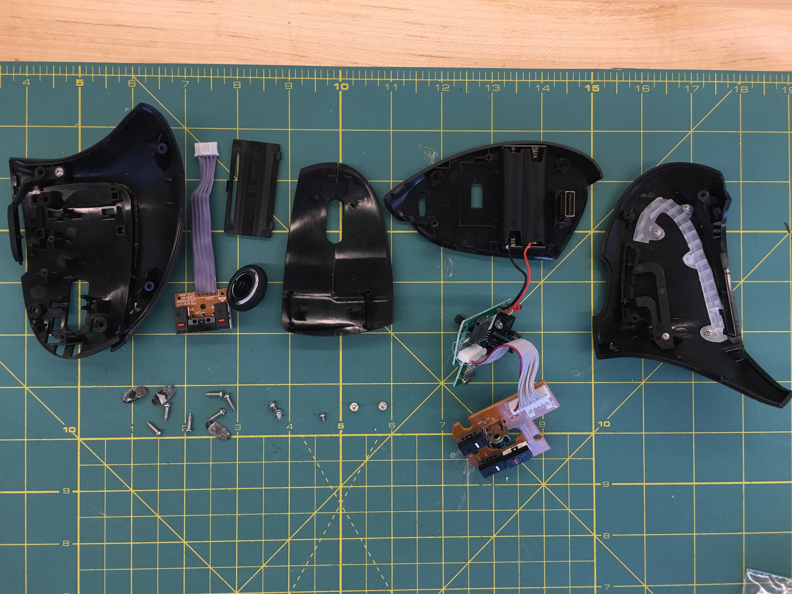
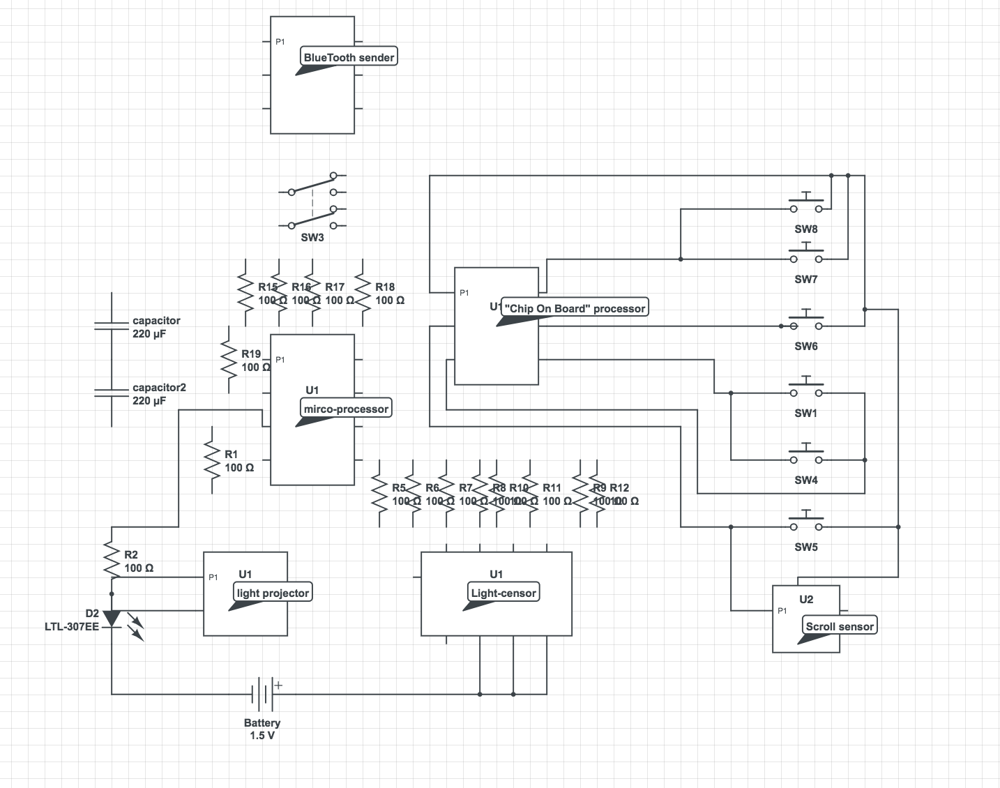
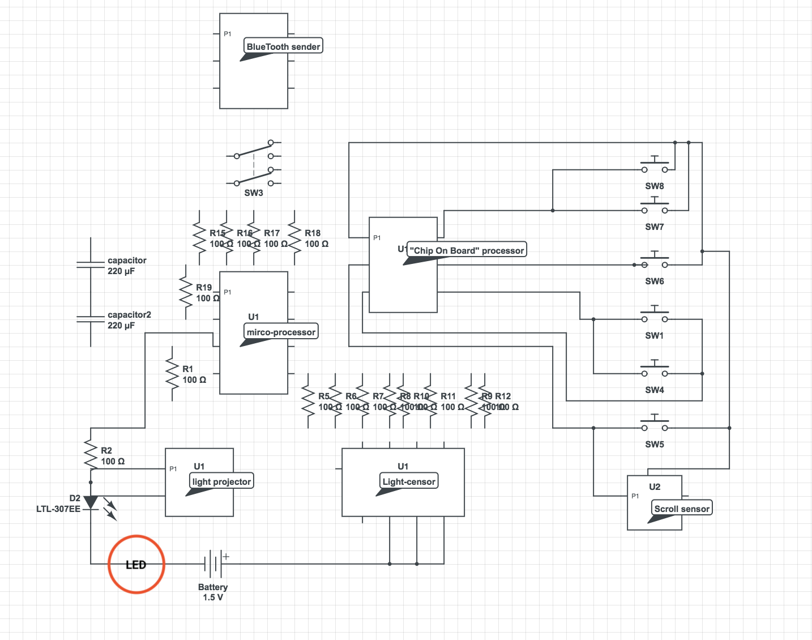

# IDD-Fa18-Lab1: Blink!
**A lab report by Rongxin Zhang**

## Part A. Set Up a Breadboard



## Part B. Manually Blink a LED

**a. What color stripes are on a 220 Ohm resistor?**

Red(2), Red(2), Black(0), Black(x1Ohm), Brown(+- 1%)

**b. What do you have to do to light your LED?**

I need to click the button that I wired on to the board similar to: https://github.com/FAR-Lab/Developing-and-Designing-Interactive-Devices/blob/docs/button_led_resistor_diagram.png
Fully wired board with click button

## Part C. Blink a LED using Arduino

### 1. Blink the on-board LED

**a. What line(s) of code do you need to change to make the LED blink (like, at all)?**

Simply change the output pin such that it is using a port instead of the default `LED_BUILTIN`.

```
pinMode(3, OUTPUT);
```

**b. What line(s) of code do you need to change to change the rate of blinking?**

I will change `delay(1000);` which lowers or increases the time in between the voltage changes.

**c. What circuit element would you want to add to protect the board and external LED?**

**d. At what delay can you no longer *perceive* the LED blinking? How can you prove to yourself that it is, in fact, still blinking?**

when the delay is `15 milliseconds`, it is difficult to figure out whether the light is still blinking. However, I know for sure that from the code that the light is blinking.

**e. Modify the code to make your LED blink your way. Save your new blink code to your lab 1 repository, with a link on the README.md.**

My custom blink function uses a random number generator to create the wait time between the HIGH and LOW voltage options.

[Custom Blink Code](./code.ino)

```java
void setup() {
  pinMode(3, OUTPUT);

  // Create a random seed based on some value
  randomSeed(analogRead(0));
}

void loop() {

  // Create a random wait value
  waitTime= random(100, 2000)

  digitalWrite(3, HIGH);   // turn the LED on (HIGH is the voltage level)
  delay(waitTime);                       // wait for a second
  digitalWrite(3, LOW);    // turn the LED off by making the voltage LOW
  delay(waitTime);                       // wait for a second
}
```

[Reference](https://www.arduino.cc/reference/en/language/functions/random-numbers/random/)

### 2. Blink your LED

**Make a video of your LED blinking, and add it to your lab submission.**

[Video Link](./assets/partc_blink.MOV)


## Part D. Manually fade an LED

**a. Are you able to get the LED to glow the whole turning range of the potentiometer? Why or why not?**

Yes, the potentiometer is a 3 pin resistor. There is a resistive material inside such that when I turn the knob, it increases the distance between the connective strip and the wire. Therefore, the further away the knob (second pin) is from the power input, the lesser voltage goes across. By connecting the first pin to power and the second pin to the input of the LED. I am able to adjust the voltage that moves across the led.


Bright


Dim

[reference](https://en.wikipedia.org/wiki/Potentiometer)

## Part E. Fade an LED using Arduino

**a. What do you have to modify to make the code control the circuit you've built on your breadboard?**

We need to replace `DigitalWrite` with the below code.

```java
// output is a value between 0 and 255
analogWrite(32, output);
```

[AnalogueWrite Code](./code-analogueWrite.ino)

**b. What is analogWrite()? How is that different than digitalWrite()?**

AnalogueWrite sends an analog voltage using PWN pulse-width modulation to specific pins. We can then set the a specific value between 0 and 255. However, DigitalWrite only provides 2 values, HIGH and LOW which. Furthermore, digital write is based purely on the amount voltage control, where HIGH=5V and LOW=0V.

[reference](https://www.arduino.cc/reference/en/language/functions/analog-io/analogwrite/)

[reference](https://www.arduino.cc/en/Tutorial/SecretsOfArduinoPWM)

## Part F. FRANKENLIGHT!!!

### 1. Take apart your electronic device, and draw a schematic of what is inside.

I took apart an ergonomic mouse.


Mouse disassembled


Main board, front and back


Secondary boards, front and back


Secondary boards, front and back

I was not able to make all the connections, especailly for the resistors as it appears the circuit is multi-layers or some of the connections are not visible. As a result, I simply showed the connections that I can physically see with my eyes and all the components.

**a. Is there computation in your device? Where is it? What do you think is happening inside the "computer?"**

There is a small micro-controller in the mouse. It's main goal should be to convert analogue signals into digital and send it through bluetooth signals. The key analogue signals come from 3 sources:
1. button clicks from left and right mouse.
2. scrollers in the middle of the mouse
3. location tracking received from the laser tracker at the bottom of the mouse.

**b. Are there sensors on your device? How do they work? How is the sensed information conveyed to other portions of the device?**

Information is transferred in the following parts:
1. button clicks is a simple one and off switch. Information are transferred to a central Chip-on-board processor that then is able transcodes the information into digital data.

**c. How is the device powered? Is there any transformation or regulation of the power? How is that done? What voltages are used throughout the system?**

The device is powered by two 1.5V batteries.

**d. Is information stored in your device? Where? How?**

The device does not appear to store state. Furthermore, it is a uni directional interaction. The device only sends information to the computer.

### 2. Using your schematic, figure out where a good point would be to hijack your device and implant an LED.

The section closest to the battery is a great place for an LED. It has already been tested and we know that this works because there is another LED near by. 

### 3. Build your light!

**Make a video showing off your Frankenlight.**

**Include any schematics or photos in your lab write-up.**
